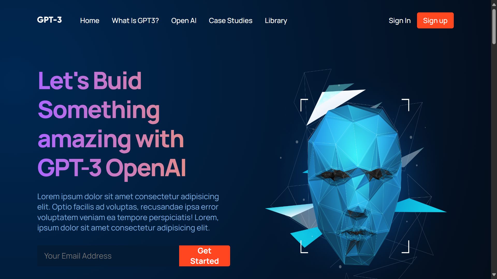

# 🤖 GPT-3 Website Template

## Overview

This is a sleek and modern website template built using React, designed to showcase GPT-3 or any AI-powered technology. The template is fully responsive and easy to customize, making it an ideal starting point for creating an AI-focused website.

## 🔗 Project URL

Check out the live version of the project here: [gpt3](https://my-gpt3-web.netlify.app/)

## 🖼️ Screenshots

## 🛠️ Technologies Used

- **React:** A JavaScript library for building user interfaces.
- **Styled Components/CSS Modules:** For styling the application in a modular and maintainable way.

## ✨ Features

- **Modern Design:** A clean and stylish design optimized for showcasing GPT-3 capabilities.
- **Responsive Layout:** Fully responsive, ensuring optimal viewing experience on all devices.
- **Customizable Sections:** Easily customizable sections to suit your needs, including a hero section, features, testimonials, and more.

## 🚀 Getting Started

To run this project locally, follow these steps:

1. Clone the repository: `git clone https://github.com/Developer-Bilal/gpt3-website.git`
2. Navigate to the project directory: `cd gpt3-website`
3. npm install
4. npm start

The application should now be running on http://localhost:3000.

## 📧 Contact

If you have any questions or suggestions, feel free to reach out:

- Email: bilalchanna67@gmail.com ✉️
- LinkedIn: [Profile](https://www.linkedin.com/in/Engineer-Bilal-Channa) 💼
